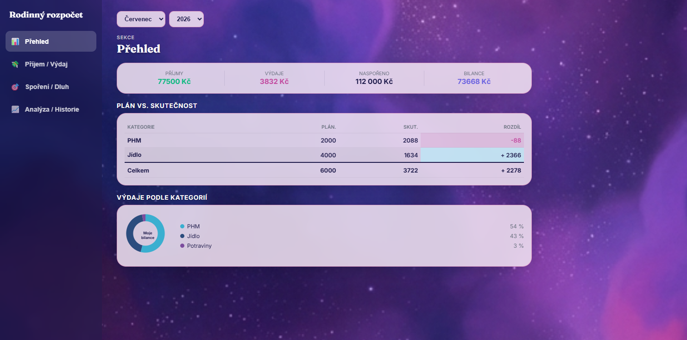
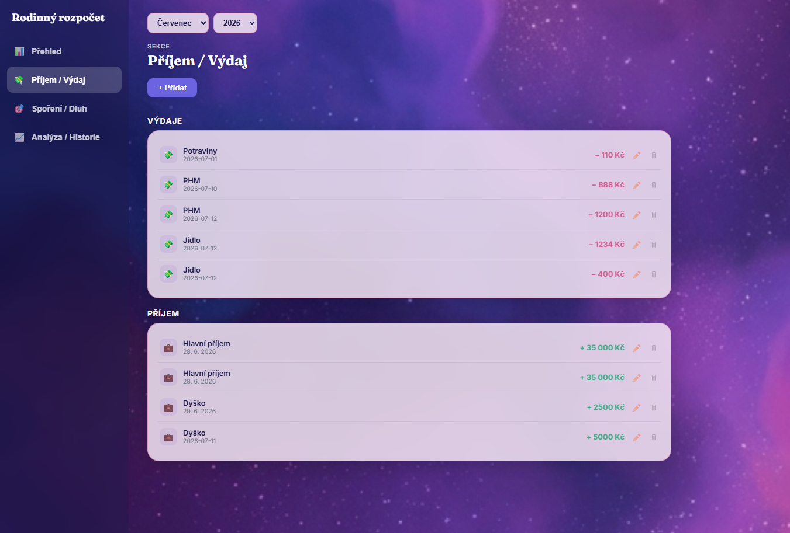
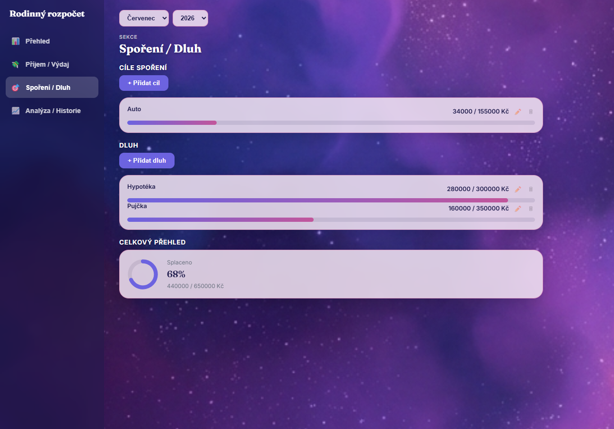
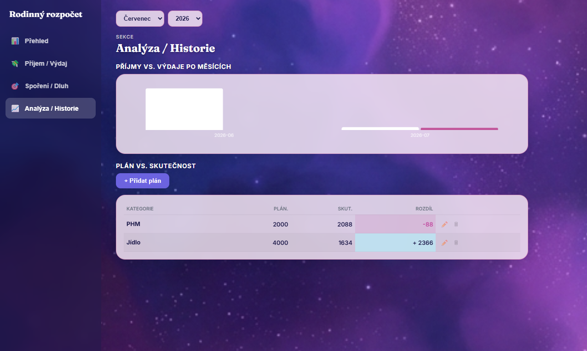
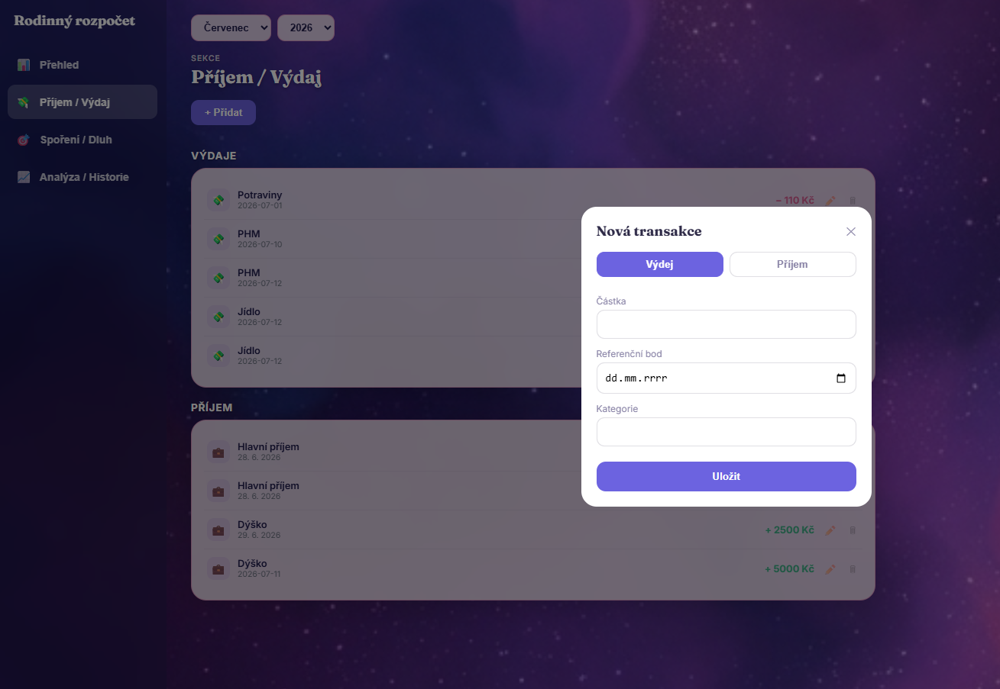

# 🏠 Rodinný rozpočet

Fullstack aplikace pro správu rodinného rozpočtu — sledování příjmů, výdajů, spořicích cílů a dluhů, s porovnáním plánovaného rozpočtu se skutečností po jednotlivých kategoriích a měsících.

Appku reálně používá naše rodina ke správě domácích financí. Není to jen cvičný projekt do šuplíku — od začátku jsem ji stavěl s cílem, aby ji manželka a já reálně používali, což ovlivňovalo i to, jaké funkce appka má a jak jsou udělané.

🔗 **Živá ukázka:** [rodinny-rozpocet-frontend.onrender.com](https://rodinny-rozpocet-frontend.onrender.com)

⚠️ *Appka běží na bezplatném tieru Renderu — po delší nečinnosti se "uspí" a první načtení může trvat cca 30–50 sekund, než se probudí. Prosím o trpělivost při prvním otevření.*

---

## 📸 Ukázka appky

### Přehled
Souhrnné statistiky, tabulka plán vs. skutečnost po kategoriích, rozklad výdajů v donut grafu.



### Příjem / Výdaj
Evidence transakcí s možností editace a mazání.



### Spoření / Dluh
Cíle spoření a dluhy s vizuálním znázorněním pokroku, souhrnný přehled celkového splacení.



### Analýza / Historie
Sloupcový graf příjmů vs. výdajů po měsících a porovnání plánu se skutečností.



### Přidání transakce


---

## ✨ Funkce appky

**Přehled**
- Souhrnné statistiky za vybraný měsíc — příjmy, výdaje, bilance, naspořená částka
- Tabulka porovnávající plánovanou a skutečnou útratu po kategoriích
- Donut graf rozkladu výdajů podle kategorie

**Příjem / Výdaj**
- Evidence příjmů (hlavní/vedlejší, s volitelným zdrojem) a výdajů (s volnou kategorií)
- Přidávání, úprava a mazání jednotlivých transakcí

**Spoření / Dluh**
- Libovolný počet cílů spoření s cílovou a naspořenou částkou
- Evidence dluhů s celkovou výší a splacenou částkou
- Progress bary pro jednotlivé položky, souhrnný kruhový graf pro celkové splacení

**Analýza / Historie**
- Sloupcový graf příjmů vs. výdajů po měsících
- Tabulka plán vs. skutečnost s možností vytvořit, upravit nebo smazat konkrétní plán

**Napříč appkou**
- Výběr měsíce a roku ovlivňuje zobrazené porovnání plánu
- Responzivní design — boční navigace se na menších obrazovkách mění na vodorovný panel
- Appka po každé akci zůstává na stejné obrazovce, jen si obnoví data

---

## 🛠️ Tech stack

**Backend**
- Java 17, Spring Boot
- Spring Data JPA (Hibernate)
- MySQL
- JUnit 5 + Mockito (testy)

**Frontend**
- React (JavaScript), Vite
- Recharts (grafy)
- Framer Motion
- Vitest + React Testing Library (testy)
- Vlastní React Context pro sdílení stavu, bez externí knihovny

---

## 🏗️ Architektura

Frontend (React)
│  fetch (api/client.js)
▼
Backend (Spring Boot)
│  Controller → Service → Repository
▼
MySQL databáze

Backend je rozdělený do standardních vrstev — Controller přijímá požadavky, Service obsahuje business logiku (např. porovnání plánu se skutečností), Repository komunikuje s databází. Mezi Entity a DTO jsou samostatné Mapper třídy.

Frontend má datový tok rozdělený do vrstev: `api/` (volání endpointů) → `hooks/` (natažení dat, stav načítání/chyb, možnost obnovení) → `context/` (sdílený stav napříč appkou) → `components/`/`slides/` (vizuální vrstva, jen přes props).

---

## 🚀 Spuštění projektu

### Varianta 1 — Docker (doporučeno)

Vyžaduje [Docker Desktop](https://www.docker.com/products/docker-desktop/).

```bash
git clone [https://github.com/Bobulka91/rodinny-rozpocet.git](https://github.com/Bobulka91/rodinny-rozpocet.git)
   cd rodinny-rozpocet
docker compose up
```

Appka poběží na `http://localhost:5173`, backend na `http://localhost:8080`.

### Varianta 2 — Lokálně bez Dockeru

**Backend** (Java 17+, Maven, běžící MySQL):
```bash
cd rozpocet-backend
./mvnw spring-boot:run
```

**Frontend** (Node.js 18+):
```bash
cd rozpocet-frontend
npm install
npm run dev
```

---

## 🧪 Testování

**Backend:**
```bash
cd rozpocet-backend
./mvnw test
```

**Frontend:**
```bash
cd rozpocet-frontend
npm run test
```

---

## 🗺️ Další plán

Dalším krokem je vytvořit **mobilní verzi appky** (React Native / Expo) se stejnou funkčností, aby ji rodina i přátelé mohli mít nainstalovanou přímo v telefonu.

V delším horizontu bych appku chtěl rozšířit o:
- Automatický import bankovních výpisů (CSV) s tříděním do kategorií
- Notifikace při překročení plánovaného rozpočtu
- Živé směnné kurzy pro sledování úspor v cizí měně

---

## 📝 O projektu

Appka je můj první samostatný fullstack projekt, který jsem stavěl při přechodu do IT z jiného oboru — jsem začínající (junior) vývojář a tohle je moje portfolio ukázka práce od návrhu databáze až po nasazení.

Appku jsem stavěl s pomocí AI (Claude) jako mentora, který mi postupně vysvětloval koncepty a principy — od základů Reactu po architekturu vrstvení dat. Snažil jsem se přitom vždy nejdřív pochopit, proč něco funguje tak, jak funguje, a napsat si to sám, ne jen zkopírovat hotové řešení. Určitě appka není dokonalá a je vidět, že jde o mou první práci tohoto rozsahu — ale je to poctivě odvedená a fungující práce, na které jsem se toho hodně naučil.
