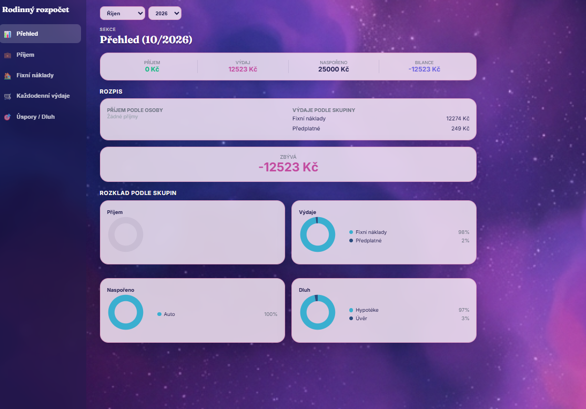
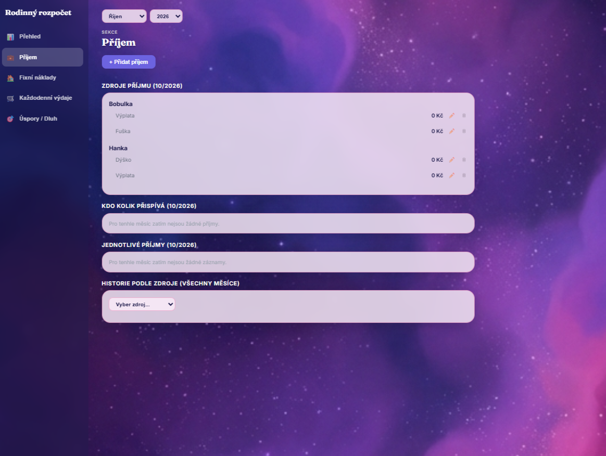
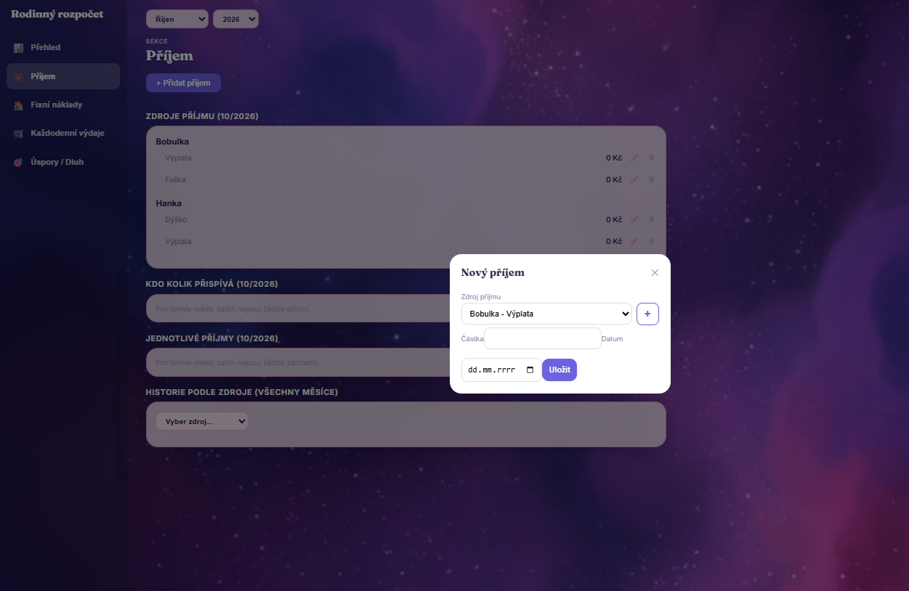
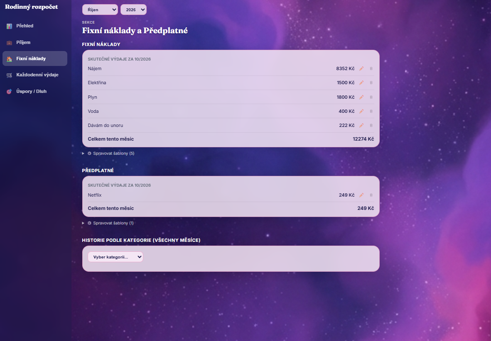
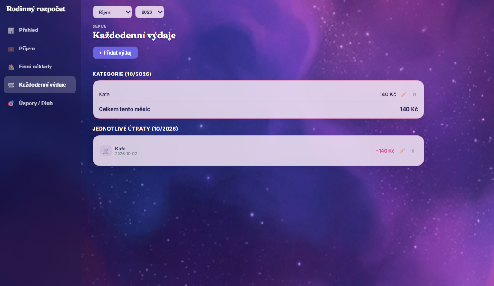
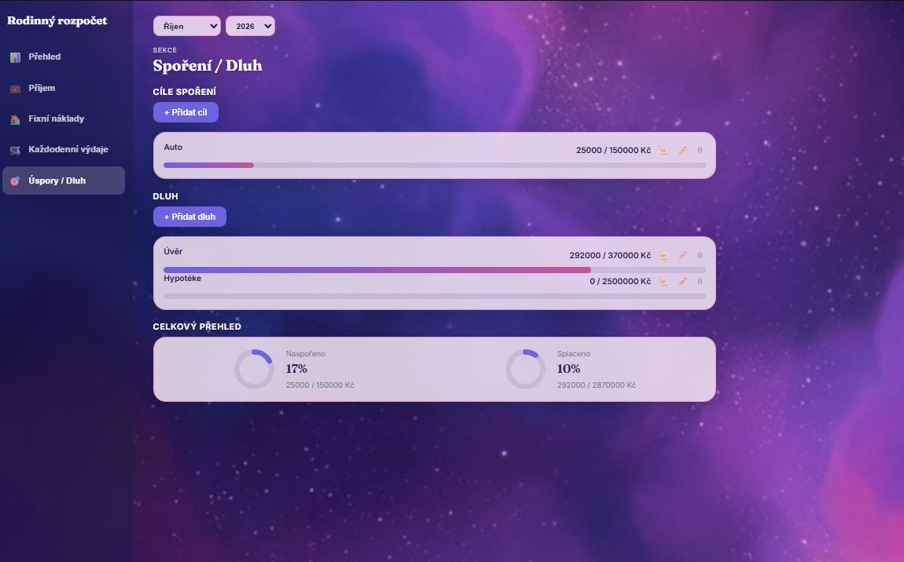

# 🏠 Rodinný rozpočet

Fullstack aplikace pro správu rodinného rozpočtu — sledování příjmů, fixních nákladů, předplatných, každodenních výdajů, spořicích cílů a dluhů, s porovnáním plánovaného rozpočtu se skutečností po jednotlivých kategoriích a měsících.

Appku reálně používá naše rodina ke správě domácích financí. Není to jen cvičný projekt do šuplíku — od začátku jsem ji stavěl s cílem, aby ji manželka a já reálně používali, což ovlivňovalo i to, jaké funkce appka má a jak jsou udělané.

📦 Tohle je **verze 2.0** — kompletní restrukturalizace datového modelu a frontendu oproti první verzi. Jak appka vypadala na začátku, najdeš v [`docs/v1-prvni-verze`](docs/v1-prvni-verze/README.md).

---

## 📸 Ukázka appky

### Přehled
Souhrnné statistiky za vybraný měsíc, tabulka plán vs. skutečnost, donut grafy rozkladu příjmů, výdajů, spoření a dluhu.



### Příjem
Trvalé zdroje příjmu (osoba + název) seskupené podle osoby, evidence jednotlivých příjmů po měsících a historie podle zdroje napříč celou historií.




### Fixní náklady a Předplatné
Šablony pravidelných nákladů s automatickým vygenerováním do aktuálního měsíce, správa šablon a historie napříč měsíci.



### Každodenní výdaje
Jednorázové výdaje po kategoriích, bez automatického generování.



### Spoření / Dluh
Cíle spoření a dluhy s historií jednotlivých vkladů a splátek, souhrnné kruhové grafy pro celkové naspoření a celkové splacení.



---

## ✨ Funkce appky

**Přehled**
- Souhrnné statistiky za vybraný měsíc — příjmy, výdaje, bilance, naspořená částka
- Tabulka porovnávající plánovanou a skutečnou útratu po skupinách kategorií
- Donut grafy rozkladu příjmů, výdajů, spoření a dluhu

**Příjem**
- Trvalé zdroje příjmu (šablony) navázané na konkrétní osobu, založitelné přímo z formuláře bez opuštění okna
- Evidence jednotlivých příjmů po měsících s úpravou a mazáním
- Historie podle zdroje napříč celou historií appky s hromadným mazáním vybraných záznamů

**Fixní náklady a Předplatné**
- Šablony kategorií se dvěma typy — fixní (automaticky generované do aktuálního měsíce ve stejné výši) a proměnlivé (jen název, částka se zadává ručně)
- Automatické vygenerování fixních nákladů jen pro aktuálně zobrazený měsíc
- Historie podle kategorie napříč měsíci s hromadným mazáním

**Každodenní výdaje**
- Jednorázové výdaje s volnou kategorií, bez šablon a automatického generování

**Spoření / Dluh**
- Libovolný počet cílů spoření a dluhů s cílovou/celkovou částkou
- Vklady a splátky se zapisují jako jednotlivé, datované záznamy s volitelnou poznámkou — aktuální naspořená/splacená částka se dopočítává automaticky, appka ji sama nikde nepřepisuje ručně
- Kompletní historie vkladů/splátek u každého cíle a dluhu, včetně mazání jednotlivých záznamů
- Souhrnné kruhové grafy — zvlášť pro celkové naspoření a zvlášť pro celkové splacení dluhu

**Napříč appkou**
- Výběr měsíce a roku ovlivňuje zobrazená data i porovnání plánu; výchozí měsíc je vždy aktuální měsíc
- Responzivní design — boční navigace se na menších obrazovkách mění na vodorovný panel
- Appka po každé akci zůstává na stejné obrazovce, jen si obnoví data

---

## 🛠️ Tech stack

**Backend**
- Java 21, Spring Boot 3.5
- Spring Data JPA (Hibernate)
- MySQL (hostováno na Aiven)
- JUnit 5 + Mockito (testy)

**Frontend**
- React 19, Vite
- Recharts, vlastní SVG grafy (donut/ring charty)
- Framer Motion
- Vitest + React Testing Library (testy)
- Vlastní React Context pro sdílení stavu, bez externí knihovny

---

## 🏗️ Architektura

```
Frontend (React)
│  fetch (api/client.js)
▼
Backend (Spring Boot)
│  Controller → Service → Repository
▼
MySQL databáze
```

Backend je rozdělený do standardních vrstev — Controller přijímá požadavky, Service obsahuje business logiku, Repository komunikuje s databází. Mezi Entity a DTO jsou samostatné Mapper třídy.

Frontend má datový tok rozdělený do vrstev: `api/` (volání endpointů) → `hooks/`/`context/` (natažení dat, sdílený stav napříč appkou) → `components/`/`slides/` (vizuální vrstva, jen přes props).

### Co se změnilo oproti verzi 1.0

Hlavní rozdíl je rozdělení dat na dva typy:

- **Šablony** (`IncomeSource`, `ExpenseCategory`) — trvalé záznamy, které existují napříč všemi měsíci (např. "Výplata" jako zdroj příjmu, nebo "Nájem" jako fixní náklad)
- **Transakce** (`Income`, `Expense`) — konkrétní záznamy vázané na jeden měsíc, odkazující na svou šablonu

V 1.0 byla kategorie u příjmů i výdajů volný text zadávaný pokaždé znovu — bez návaznosti mezi záznamy napříč měsíci. To fungovalo pro malou appku, ale neškálovalo by to (překlepy v názvu kategorie, žádný přehled "kolik vydělává konkrétní osoba", nemožnost automaticky generovat fixní náklady).

Stejný princip "ulož, nepočítej pořád dokola" se používá i u `MonthlyBalance` (zůstatek měsíce) a nově i u `SavingGoal.currentAmount` / `Debt.paidAmount` — aktuální hodnota je uložené pole, které se mění jen přes transakční metody při přidání/smazání vkladu nebo splátky, ne přepočítáváním z historie při každém zobrazení.

---

## 🚀 Spuštění projektu

### Varianta 1 — Docker (doporučeno)

Vyžaduje [Docker Desktop](https://www.docker.com/products/docker-desktop/).

```bash
git clone https://github.com/Bobulka91/rodinny-rozpocet.git
cd rodinny-rozpocet
docker compose up
```

Appka poběží na `http://localhost:5173`, backend na `http://localhost:8080`.

### Varianta 2 — Lokálně bez Dockeru

**Backend** (Java 21+, Maven, běžící MySQL):
```bash
cd rozpocet-backend
./mvnw spring-boot:run
```

**Frontend** (Node.js 18+):
```bash
cd rozpocet-frontend
npm install
npm run dev
```

---

## 🧪 Testování

**Backend:**
```bash
cd rozpocet-backend
./mvnw test
```

**Frontend:**
```bash
cd rozpocet-frontend
npm run test
```

---

## 🗺️ Další plán

Další krok je zabezpečení appky — vlastní účty, přihlášení a oddělení dat jednotlivých uživatelů (Spring Security, JWT), aby appku mohlo reálně používat víc rodin nezávisle na sobě.

Po zabezpečení plánuji **mobilní verzi appky** (React Native / Expo) postavenou na stejné restrukturalizované architektuře, aby ji rodina i přátelé mohli mít nainstalovanou přímo v telefonu.

V delším horizontu bych appku chtěl rozšířit o:
- Automatický import bankovních výpisů (CSV) s tříděním do kategorií
- Notifikace při překročení plánovaného rozpočtu
- Živé směnné kurzy pro sledování úspor v cizí měně

---

## 📝 O projektu

Appka je můj první samostatný fullstack projekt, který jsem stavěl při přechodu do IT z jiného oboru — jsem začínající (junior) vývojář a tohle je moje portfolio ukázka práce od návrhu databáze až po nasazení.

Appku jsem stavěl s pomocí AI (Claude) jako mentora, který mi postupně vysvětloval koncepty a principy — od základů Reactu po architekturu vrstvení dat a návrh datového modelu. Verze 2.0 vznikla tak, že jsem se zpětně vrátil k hotové appce z 1.0, poznal jsem v ní architektonické nedostatky (volný text místo šablon, ruční přepisování součtů) a společně s AI jsem to přepracoval na čistší řešení — místo abych appku nechal tak, jak byla, a jen přidával další funkce navrch.

Snažil jsem se přitom vždy nejdřív pochopit, proč něco funguje tak, jak funguje, a napsat si to sám, ne jen zkopírovat hotové řešení. Appka určitě není dokonalá a je vidět, že jde o mou první práci tohoto rozsahu — ale je to poctivě odvedená a fungující práce, na které jsem se toho hodně naučil.
